# Journal App Architecture

## Overview

Local-first, encrypted markdown notes app built with React + TypeScript. Uses PGlite (SQLite in browser via WASM) for local storage with bidirectional sync to Homebase (personal encrypted cloud).

## Tech Stack

- **Framework**: React 18 + Vite + TypeScript
- **Local DB**: PGlite (SQLite WASM)
- **Editor**: TipTap (rich text) + Yjs (CRDT)
- **Cloud Sync**: Homebase SDK
- **AI**: WebLLM (on-device)
- **Styling**: Tailwind CSS + shadcn/ui

---

## Directory Structure

```
src/
├── components/          # React components
│   ├── auth/           # Login, OAuth callback
│   ├── editor/         # TipTap editor, toolbar
│   ├── layout/         # Sidebar, folder tree
│   ├── modals/         # Dialogs (settings, export)
│   └── ui/             # shadcn primitives
├── hooks/              # React hooks
│   ├── auth/           # useAuth, useYouAuthAuthorization
│   ├── mutations/      # useNoteMutations, useFolderMutations
│   ├── queries/        # useNotes, useFolders
│   └── useSyncService  # Homebase sync orchestration
├── lib/                # Core logic
│   ├── db/             # PGlite database + queries
│   ├── homebase/       # Sync engine (providers + service)
│   ├── yjs/            # Yjs persistence provider
│   ├── webllm/         # AI engine wrapper
│   └── workers/        # Web Workers
├── pages/              # Route pages
├── types/              # TypeScript types
└── layouts/            # Page layouts
```

---

## Data Flow


---

## Key Modules

### Database (`lib/db/`)
| File | Purpose |
|------|---------|
| `pglite.ts` | PGlite initialization, schema migrations |
| `queries.ts` | All SQL operations (notes, folders, sync records) |

### Homebase Sync (`lib/homebase/`)
| File | Purpose |
|------|---------|
| `config.ts` | Drive identifiers, file types |
| `NotesDriveProvider.ts` | Note CRUD + image uploads (uses `patchFile`) |
| `FolderDriveProvider.ts` | Folder CRUD (uses `patchFile`) |
| `SyncService.ts` | Bidirectional sync orchestration |
| `InboxProcessor.ts` | Fetch remote changes via `queryBatch` |

### Hooks (`hooks/`)
| File | Purpose |
|------|---------|
| `useSyncService.ts` | Auto-sync, offline detection, retry logic |
| `useJournalState.ts` | Global app state, logout handler |
| `useWebLLM.ts` | AI model loading + inference |

---

## Sync Architecture

### Overview

The sync engine implements bidirectional synchronization between local PGlite database and Homebase cloud storage. It follows **local-first** principles: all writes hit local DB immediately, then sync in background.

```mermaid
flowchart TB
    subgraph Local["🖥️ Browser"]
        UI["React UI"] --> Hooks["Mutation Hooks"]
        Hooks --> PGlite[("PGlite DB")]
        Hooks --> YjsDoc["Yjs Document"]
        YjsDoc --> PGlite
        PGlite --> SyncRecords[("sync_records")]
    end
    
    subgraph SyncLayer["⚡ Sync Layer"]
        SyncRecords --> SyncService["SyncService"]
        SyncService --> Push["pushNote / pushFolder"]
        SyncService --> Pull["InboxProcessor"]
    end
    
    subgraph Cloud["☁️ Homebase"]
        Push --> Drive[("Encrypted Drive")]
        Drive --> Pull
    end
    
    Pull --> PGlite
```



---

### Sync Record Lifecycle

Every local change creates a `sync_record` entry that tracks sync state:


**States:**
| State | Meaning |
|-------|---------|
| `pending` | Needs to be pushed to Homebase |
| `synced` | Successfully synced |
| `error` | Push failed, will retry |

---

### Push Flow (Local → Remote)

When user edits a note locally:


---

### Pull Flow (Remote → Local)

When changes exist on remote:


---

### Yjs CRDT Merge

Content conflicts are resolved using Yjs CRDT (Conflict-free Replicated Data Type):


**Key insight:** Yjs preserves all operations from both sides, ordering by logical timestamps. No data is ever lost.

---

### Offline & Retry


**Auto-reconnection:**
```typescript
window.addEventListener('online', () => {
    sync(); // Immediately sync when back online
});
```

---

### Component Interactions


---

### Database Tables for Sync

```sql
-- Tracks what needs to sync
CREATE TABLE sync_records (
    id TEXT PRIMARY KEY,
    entity_type TEXT,        -- 'note' | 'folder'
    entity_id TEXT,
    sync_status TEXT,        -- 'pending' | 'synced' | 'error'
    remote_file_id TEXT,
    remote_version_tag TEXT,
    last_sync_attempt INTEGER,
    error_message TEXT
);

-- Tracks pending image uploads
CREATE TABLE pending_image_uploads (
    id TEXT PRIMARY KEY,
    note_id TEXT,
    image_blob BLOB,
    filename TEXT,
    created_at INTEGER
);
```

---

## File Type Constants

| Type | fileType | dataType |
|------|----------|----------|
| Note | 605 | 706 |
| Folder | 606 | 707 |

**Payload keys:**
- `jrnl_txt` - Yjs content blob (binary, `application/octet-stream`)
- `jrnl_img0..N` - Image payloads with thumbnails

---

## Security

- **Encryption**: All Homebase files encrypted with owner key
- **ACL**: `SecurityGroupType.Owner` (private to user)
- **Local**: PGlite data stored in browser IndexedDB
- **Logout**: Calls `clearAllLocalData()` to wipe all local data

