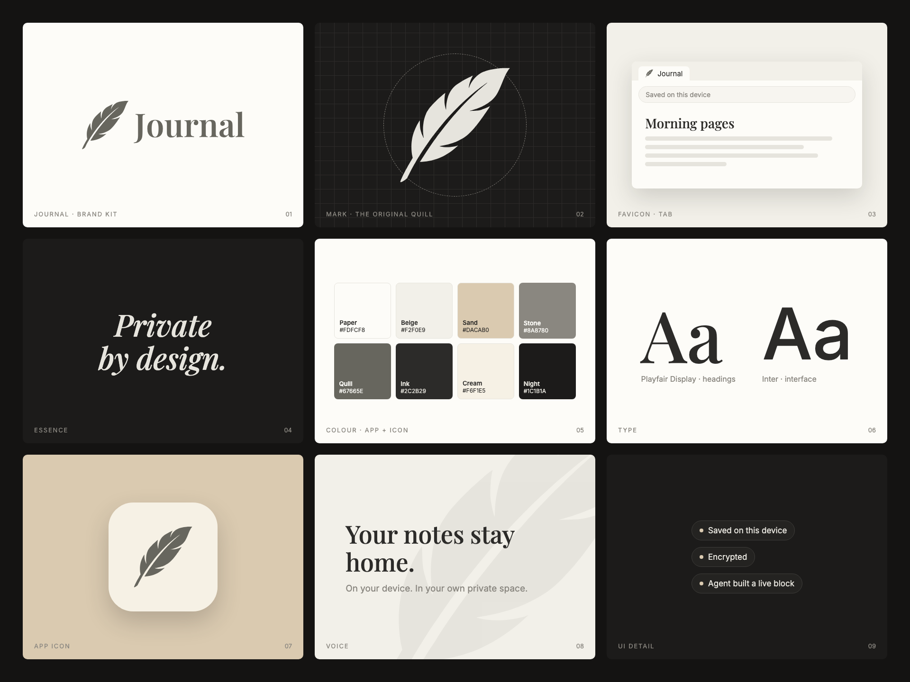

# Journal brand kit



## Pitch

> Journal is a private notebook that keeps your notes on your device, encrypted, and lets AI agents build live, interactive pages inside them.

"Encrypted on your device" depends on #555. Until that ships, say "encrypted sync".

## Taglines

1. **Private by design.**
2. **Your notes stay home.**
3. **Agents build. You keep it.**

Lead with privacy and the device. Homebase is "your own private space" under the hood, never a requirement. See [positioning.md](positioning.md).

## Logo

The mark is the quill from the existing app icon, traced from `public/logo.webp` into an SVG, in its original colours: a Quill grey feather on a Cream card. The wordmark adds "Journal" in Playfair Display at weight 600, converted to outlines so it needs no font.

| File | Use |
| --- | --- |
| `logo/mark-light.svg`, `logo/mark-dark.svg` | Mark on light / dark backgrounds |
| `logo/wordmark-light.svg`, `logo/wordmark-dark.svg` | Mark + "Journal" lockup |
| `logo/favicon.svg` | Favicon; switches to light ink in dark mode |
| `logo/app-icon.svg` | Full-bleed app icon (platforms apply their own mask) |
| `png/` | Rendered PNGs, `favicon.ico` (16/32/48) and app icons (1024/512/192/180) |

Keep clear space around the mark of at least a quarter of its height. Don't recolour it outside the palette, rotate it, or add effects.

## Colour and type

`tokens.css` mirrors `src/index.css`. If the app palette changes, update both.

| Token | Hex | App variable |
| --- | --- | --- |
| Paper | `#FDFCF8` | `--background` |
| Ink | `#2C2B29` | `--foreground`, `--primary` |
| Beige | `#F2F0E9` | `--secondary`, `--muted` |
| Line | `#E6E4DD` | `--border` |
| Stone | `#8A8780` | `--muted-foreground` |
| Night | `#1C1B1A` | `.dark --background` |
| Card | `#242321` | `.dark --card` |
| Mist | `#E6E4DD` | `.dark --foreground` |
| Quill | `#67665E` | brand only, the feather in `public/logo.webp` |
| Cream | `#F6F1E5` | brand only, the icon card in `public/logo.webp` |
| Sand | `#DACAB0` | brand only, from `public/banner.webp` |

Type: **Playfair Display** for headings and the wordmark, **Inter** for interface and body text.

## Templates

Open a template in a browser or render it. Each one takes query parameters.

- `templates/social-card.html` is 1200×630: `?title=…&kicker=…&theme=dark`
- `templates/screenshot-frame.html` is 1600×1000: `?src=<screenshot>&caption=…&theme=dark`
- `templates/board.html` is the 1920×1440 overview above

## Rendering

From the repo root (uses Playwright, already a dev dependency):

```bash
node brand/render.mjs
```

This rewrites everything in `png/`. Templates load fonts from Google Fonts, so it needs a network connection.
