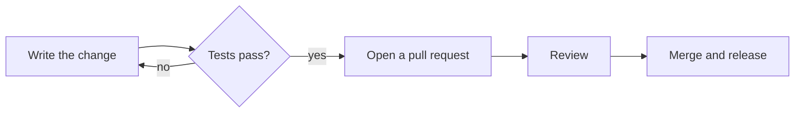

# Writing Journal notes

A Journal note is a title, tags, an optional cover image and a body. The MCP tools read
and write the body as markdown: `get_note` returns it, and `create_note`,
`append_to_note`, `replace_in_note` and `update_note` take it. Everything in this guide
renders in the Journal editor and on the note's public share page, in the light and the
dark theme, and comes back from `get_note` as the same markdown you wrote (an uploaded
image comes back as `attachment://…`).

A note can hold far more than text. Besides the native blocks below, a live block can be a
diagram, a chart, a dashboard, a calculator, a simulation or a small game. Reach for one
whenever an interactive or visual block makes the note more useful.

## Native blocks

These are the note's own blocks: the reader can edit them in place in Journal, and they
stay readable as markdown. Prefer one whenever it can carry the content.

### Text

Headings `#` to `######`, paragraphs, `**bold**`, `*italic*`, `~~strike~~`, `` `code` ``,
`[links](https://…)`, `---` for a rule and `>` for a quote. Underline, subscript and
superscript are `<u>…</u>`, `<sub>…</sub>` and `<sup>…</sup>`. A fenced code block with a
language is highlighted:

````markdown
```python
print("hello")
```
````

### Lists and task lists

```markdown
- A bullet
  - A nested bullet
1. A numbered item

- [ ] Book the train
- [x] Pack
```

### Tables

GitHub-style pipe tables. A table with no header row has an empty header line.

```markdown
| Day | Distance | Time |
| --- | --- | --- |
| Mon | 5 km | 28 min |
| Wed | 8 km | 46 min |
```

### Callouts

A blockquote whose first line is `> [!info]`, `> [!tip]`, `> [!warning]` or `> [!error]`.

```markdown
> [!warning]
> Back up the database before running the migration.
```

### Toggles

`<details>` with a `<summary>` line, then a blank line, the body, a blank line and
`</details>`. The body can hold any markdown.

```markdown
<details>
<summary>Full error log</summary>

The body, hidden until the reader opens it.

</details>
```

### Math

LaTeX, drawn with KaTeX: inline between single dollars, as a block between `$$` lines.

```markdown
The energy is $E = mc^2$.

$$
\int_0^1 x^2 \, dx = \frac{1}{3}
$$
```

### Footnotes

`text[^1]` with `[^1]: the note` on its own line. Journal numbers footnotes by the order
they are referenced in and keeps the notes at the end of the body. In `append_to_note`, a
`[^n]` with a definition is a new footnote, and one without points at the note's existing
footnote n.

```markdown
Journal syncs through your own Homebase identity.[^1]

[^1]: Nothing is stored on a Journal server.
```

### Images in the body

In markdown passed to `create_note`, `append_to_note`, `replace_in_note`'s `new_text` and
`update_note`:

- `` (wrap the path in `<>` if it has spaces) or
  `` is uploaded to the note and shown there. Prefer a
  path: it costs no tokens.
- PNG, JPEG or WebP, at most 5 MB each. Metadata such as EXIF and GPS is removed before
  upload. If any image is invalid, the call fails and nothing is written.
- `get_note` returns an uploaded image as ``. Keep that as it is to
  keep the image.
- `https://` image URLs are kept as they are, not fetched or uploaded.

### Covers

A cover is the wide image above the title. It is not in the markdown: set it with
`set_note_cover` (`image` is a file path or a `data:` URI, PNG, JPEG or WebP up to 5 MB,
recommended 2400×1260 and at least 1200×630, `positionY` 0 to 100 for the focal point,
`dark: true` for a dark-mode variant next to an existing cover) and remove it with
`clear_note_cover`. Use a cover rather than an image at the top of the body: it also feeds
the link preview of a public note.

### Not available through these tools

Link-preview cards (a link on its own line stays a plain link) and note-to-note links.

## Live blocks

A fenced code block whose language is `mermaid`, `svg`, `html` or `react` renders live.
Journal shows a preview with a Code / Preview toggle, in the editor and on the share page.

| Language | Renders as | Runs script |
|---|---|---|
| `mermaid` | a diagram, coloured to match the light or dark theme | no |
| `svg` | an image; scripts and external references inside the SVG are ignored | no |
| `html` | a running page in a sandboxed frame | yes, isolated |
| `react` | a React component, run on Journal's own React in the same frame as `html` | yes, isolated |

Give each block an id after the language, ```` ```html id=k3f9 ````: 4 to 12 lowercase
letters and digits, different for each block in the note. The id keys the block's saved state (see
`journal.storage` below). **Keep the `id=…` part of the fence whenever you rewrite a
block**, with `replace_in_note` or `update_note`, or the block loses its saved state.

### `mermaid`

Any Mermaid diagram: flowchart, sequence, class, state, ER, gantt, pie, timeline,
mindmap and more. Journal draws it in its own theme. Leave colours to it: no
`%%{init}%%` theme and no `style` or `classDef` colours.

### `svg`

One `<svg>` element with a `viewBox`, shown as an image. It cannot use the theme
variables, so its colours are fixed: pick mid-tones that read on a light and a dark page,
or draw the picture as inline `<svg>` in an `html` block, where `var(--…)` works.

### How an `html` block works

The block's source is loaded into an `<iframe sandbox="allow-scripts">` with a strict
Content-Security-Policy. The frame has its own throwaway origin, so the page cannot see
the note, the app, or anything stored by Journal.

An `html` block **can** contain:

- A full document or just a fragment. A lone `<div>…</div>` is fine; `<html>` and
  `<body>` are optional.
- Inline `<style>` and inline `<script>`, including event handlers, timers, `<canvas>`,
  inline `<svg>`, CSS animations and form controls handled by script.
- Images, fonts and media as `data:` URIs.
- Scripts, stylesheets and fonts from three CDN hosts: `https://cdn.jsdelivr.net`,
  `https://cdnjs.cloudflare.com` and `https://unpkg.com` (`<script src>`,
  `<link rel="stylesheet">`, `@font-face`). They load only while the reader is online.
  React needs its UMD build and JSX needs Babel standalone, both from those hosts; a
  `react` block (below) needs neither.

It **cannot**:

- Make network requests: `fetch`, `XMLHttpRequest` and `WebSocket` all fail.
- Load anything from another host: a `<script src>`, stylesheet or font from any host not
  listed above is blocked, and there are no `https://` images or media.
- Use Tailwind's CDN script: it does not work in the frame.
- Use browser storage. `localStorage`, `sessionStorage`, `indexedDB` and `document.cookie`
  throw a `SecurityError`, so wrap any such call in `try`/`catch`. Use `journal.storage`
  (below) to keep state.
- Open popups, submit forms to a URL, navigate the app, or start downloads.

The frame is as tall as its content, up to 1600px (taller content scrolls inside it), and
the reader can drag it to another height. It is as wide as the note column, so design for
roughly 650px and let the layout stretch.

An `html` or `react` block that needs more room can ask for it with `wide` in its fence,
next to the id: ```` ```react wide id=k3f9 ```` or ```` ```html wide ````. A `wide` block
leaves the note column for the width of the editor (keeping its side margin) or of the
share page, up to about 1150px and centred on the column, and can be up to 2400px tall.
On a phone it simply fills the width. `wide` is part of the fence, so it is in the markdown
`get_note` returns: keep it when rewriting the block, as you keep the id. When to use it
is under "Layout" below.

Every `html` and `react` block has an Expand button next to its Code / Preview toggle, in
the editor and on the share page. It shows the same running block fullscreen, with its
state; Esc or Close returns to the note.

### Saved state: `journal.storage`

An `html` or `react` block can save small state in the note, so it is there the next time
the note is opened, on any device the note syncs to:

```js
journal.storage.get('count').then((saved) => {
  const count = (saved ?? 0) + 1; // undefined until it is set
  return journal.storage.set('count', count);
});
```

- `journal.storage.get(key)` and `journal.storage.set(key, value)` both return promises.
  They are there before the block's own scripts run.
- The state is keyed by the block's id, in the fence's info string. A block without an id
  gets one the first time it calls `set`. Do not give two blocks the same id: they would
  share their state.
- A key is a string of at most 256 characters. A value must be JSON: a string, a finite
  number, `true`, `false`, `null`, or an array or plain object of those. Anything else
  (`undefined`, a `Date`, a `Map`, a function…) rejects the promise and saves nothing.
- A block's whole state can be at most 64 KB as JSON. A `set` that would go over rejects
  with an error and saves nothing.
- `set` resolves at once; Journal writes the latest state to the note at most once a
  second, so calling it often is fine.
- A block reads and writes only its own state: never another block's, nor the note.
- The state is not in the markdown (only the id is), so `get_note` does not return it.
- On a public note, the saved state is published with the note. A reader of the public
  page sees the owner's state, read-only: their own `set` calls change what the block
  shows until they reload the page, and never reach the note.

### How a `react` block works

A `react` block is JSX that defines a component named `App`, or exports one as default.
Journal compiles it and renders `App` on its own copy of React, the version the app itself
runs, in the same sandboxed frame as an `html` block: everything above about the frame
applies, and no CDN script is needed. `jsx` and `tsx` blocks stay ordinary code.

- Hooks are on `React` (`React.useState`, `React.useCallback`, …), and `useState`,
  `useEffect`, `useRef`, `useMemo` and `useReducer` also work without the prefix.
- It can import from `react`, `recharts`, `lucide-react`, `d3`, `three`, `lodash-es`
  (also as `lodash`), `mathjs`, `papaparse` and `journal-ui`, and from nothing else: any
  other import shows "A react block can import only react, recharts, lucide-react, d3,
  three, lodash-es, lodash, mathjs, papaparse and journal-ui, not …" in the frame. All of
  them come with Journal, and each loads only for a block that imports it, so a block needs
  no network and works offline. TypeScript is not supported.
- `journal-ui` is Journal's UI kit (below).
- `className` takes Tailwind classes, drawn in Journal's theme (below).
- `recharts` charts are drawn in the theme without colour props (below).
- `lucide-react` icons draw in `currentColor`, so they take the text colour around them:
  `<Heart className="size-4 text-muted-foreground" />`.
- State in the component is lost on reload; keep what should last with `journal.storage`.
- A syntax error is shown with its line in place of the component; an error while
  rendering is shown inside the frame.

````markdown
```react id=c0un7
function App() {
  const [count, setCount] = useState(0);
  return (
    <div>
      <p>Count: {count}</p>
      <button onClick={() => setCount(count + 1)}>Add one</button>
    </div>
  );
}
```
````

The design rules below apply to a `react` block unchanged.

#### Libraries in a `react` block

- `d3` is D3 7 (`import * as d3 from 'd3'`), `three` is three.js (`import * as THREE from
  'three'`, drawing with `WebGLRenderer`), `lodash-es` is lodash (`import _ from 'lodash'`
  or named imports), `mathjs` is math.js (`import { evaluate } from 'mathjs'`), `papaparse`
  is Papa Parse (`import Papa from 'papaparse'`).
- The frame has no network, so give a library its data inline: `Papa.parse` a string,
  never a URL, and never `d3.csv` or `d3.json`. Papa Parse's `worker` option fails too.
- The frame forbids eval, so code that compiles code fails: `d3.csvParse` and
  `d3.tsvParse` (use Papa Parse, or `d3.csvParseRows`), and lodash's `template`.

#### The `journal-ui` kit

Controls in Journal's theme, light and dark, under the names and props of shadcn/ui.
Prefer them to hand-styled controls.

| Component | Props |
|---|---|
| `Button` | `variant`: `default` `secondary` `outline` `ghost` `destructive` `link`; `size`: `default` `sm` `lg` `icon` |
| `Card`, `CardHeader`, `CardTitle`, `CardDescription`, `CardContent`, `CardFooter` | |
| `Tabs`, `TabsList`, `TabsTrigger`, `TabsContent` | `Tabs`: `value` or `defaultValue`, `onValueChange`; a trigger and its content share a `value` |
| `Input` | an `<input>` |
| `Select`, `SelectItem` | the browser's own select: `value` or `defaultValue`, `onValueChange`, `placeholder`; each `SelectItem` has a `value`. There is no `SelectTrigger`, `SelectValue` or `SelectContent` |
| `Slider` | one thumb: `value` or `defaultValue` as `[n]`, `onValueChange(([n]) => …)`, `min` `max` `step` |
| `Switch` | `checked` or `defaultChecked`, `onCheckedChange` |
| `Badge` | `variant`: `default` `secondary` `destructive` `outline` |
| `Progress` | `value`, 0 to 100 |

`className` adds Tailwind classes, each replacing the component's own class of the same
kind (`<Button className="w-full">`).

````markdown
```react
import { Card, CardHeader, CardTitle, CardContent, Slider, Switch, Badge } from 'journal-ui';

export default function App() {
  const [goal, setGoal] = useState([500]);
  const [daily, setDaily] = useState(true);
  return (
    <Card>
      <CardHeader>
        <CardTitle>Writing goal</CardTitle>
      </CardHeader>
      <CardContent className="space-y-3">
        <Slider value={goal} onValueChange={setGoal} max={2000} step={50} />
        <label className="flex items-center gap-2 text-sm">
          <Switch checked={daily} onCheckedChange={setDaily} /> Every day
        </label>
        <Badge variant="secondary">{goal[0]} words</Badge>
      </CardContent>
    </Card>
  );
}
```
````

#### Tailwind in a `react` block

A `react` block gets a fixed Tailwind stylesheet, built with Journal and drawn in its
theme. It follows the light and dark theme by itself: no `dark:` variant is needed, and
`dark:` classes do nothing. Classes outside this list also do nothing. There is no
preflight: the frame keeps the note's font, and unstyled buttons, inputs and tables
still look like Journal's.

| Family | Classes |
|---|---|
| Layout | `block` `inline-block` `inline` `flex` `inline-flex` `grid` `inline-grid` `hidden` `contents`, `flex-row` `flex-col` (and `-reverse`) `flex-wrap` `flex-nowrap` `flex-1` `flex-auto` `flex-none` `grow` `shrink-0`, `items-*` `justify-*` `self-*` `content-*` `place-items-center`, `grid-cols-1`…`12` `col-span-1`…`12`/`full` `grid-rows-1`…`6` `row-span-*`, `gap-*` `gap-x-*` `gap-y-*` `space-x-*` `space-y-*`, `relative` `absolute` `sticky` `inset-*` `top-*` …, `z-*`, `overflow-*`, `aspect-square` `aspect-video`, `object-cover` `object-contain` |
| Spacing | `p` `px` `py` `pt` `pr` `pb` `pl` `m` `mx` `my` `mt` `mr` `mb` `ml`, `0` to `24` on Tailwind's scale, and `m*-auto` |
| Sizing | `w-*` `h-*` `size-*` (the spacing scale up to `96`, `auto` `full` `fit` `min` `max` and halves to quarters), `w-screen` `h-screen`, `min-w-*` `min-h-*`, `max-w-xs`…`4xl` `max-w-prose` `max-w-full`, `max-h-*` |
| Typography | `text-xs`…`text-6xl`, `font-sans` (the note's font) `font-mono`, `font-light`…`font-extrabold`, `leading-*` `tracking-*`, `text-left` `text-center` `text-right` `text-justify`, `truncate` `line-clamp-1`…`3` `break-words` `whitespace-*`, `uppercase` `italic` `underline` `tabular-nums` |
| Borders | `border` `border-0` `border-2` `border-4` and each side, `border-dashed` `border-dotted`, `divide-x` `divide-y`, `rounded` `rounded-sm`…`rounded-full` and each side, `ring` `ring-0`…`ring-4` `ring-inset` |
| Effects | `opacity-*`, `shadow` `shadow-sm`…`shadow-2xl` (all one hairline: the note is flat), `transition` `transition-colors` `duration-100` `200` `300` `ease-*`, `cursor-pointer` `select-none` `sr-only` |
| Colours | `bg-*` `text-*` `border-*` `from-*` `via-*` `to-*` with `bg-gradient-to-*` or `bg-linear-to-*`, and `hover:bg-*`: every colour name below. `ring-*` `divide-*` `hover:text-*` `hover:border-*`: the theme names and the grays. `fill-*` `stroke-*` `focus-visible:ring-*` `focus-visible:border-*`: the theme names, `white`, `black` and `current` |
| Variants | `hover:` and `focus-visible:` on the colours above, `hover:opacity-*`, `focus-visible:ring-*` `focus-visible:outline-none`; `sm:` on display, flex direction, `grid-cols-*`, `col-span-*` and text size. The frame is about 650px wide, so `md:` and wider are not in the sheet, even for a `wide` or fullscreen block |

A bare `border`, `divide-y` or `ring` is drawn in `--border` or `--ring`.

The colour names are the theme's: `background` `foreground` `card` `card-foreground`
`popover` `popover-foreground` `primary` `primary-foreground` `secondary`
`secondary-foreground` `muted` `muted-foreground` `accent` `accent-foreground`
`destructive` `destructive-foreground` `border` `input` `ring` `chart-1`…`chart-5`, and
`transparent` `current` `inherit`. Prefer them (`bg-muted`, `text-muted-foreground`,
`border`). Tailwind's palette names work too, mapped to the theme so that a block written
for stock Tailwind still matches the note:

| Tailwind name | Drawn in |
|---|---|
| `white`, `black` | `--background`, `--foreground` |
| `slate` `gray` `zinc` `neutral` `stone` 50–200 | `--muted` |
| the same, 300 | `--border` |
| the same, 400–600 | `--muted-foreground` |
| the same, 700–950 | `--foreground` |
| `red` `orange` `pink` `rose` | `--chart-2` |
| `green` `emerald` `lime` `teal` | `--chart-3` |
| `amber` `yellow` | `--chart-4` |
| `blue` `indigo` `sky` `cyan` `violet` `purple` `fuchsia` | `--chart-5` |

No hue is drawn in `--chart-1`: it is nearly the text colour.

A hue's shades 300–600 are its chart colour itself. Shades 50, 100 and 200 are that colour
washed into `--background` (12%, 20% and 32% of it), and shades 700, 800, 900 and 950 are
it taken towards `--foreground` (80%, 65%, 50% and 35% of it). So `bg-blue-50 text-blue-900`
is a pale panel with strong text in both themes, and `bg-blue-500 text-white` a strong
button. Opacity modifiers such as `bg-blue-500/50` are not in the sheet.

#### Charts in a `react` block

`recharts` is Recharts 3, drawn in Journal's theme. Leave the colour props out:

- Series take `--chart-2` … `--chart-5` in the order they appear, then start again at
  `--chart-2` (`--chart-1` is nearly the text colour): `Line`, `Area` and `Radar` their
  line and fill, `Bar` and `Scatter` their fill. A `Pie` gives each sector the next colour.
- `CartesianGrid` and `PolarGrid` use `--border`. `XAxis`, `YAxis` and the polar axes draw
  their lines in `--border` and their tick labels in `--muted-foreground`.
- `Tooltip` and `Legend` text is `--foreground`, the tooltip on `--background`.
- A colour the block sets wins, except the sample colours of the Recharts docs:
  `#8884d8`, `#82ca9d`, `#ffc658`, `#ff7300` and `#413ea0` become `--chart-2`,
  `--chart-3`, `--chart-4`, `--chart-5` and `--chart-2`, as the series do.
- A cartesian chart (`LineChart`, `BarChart`, `AreaChart`, `ComposedChart`,
  `ScatterChart`) has a 20px right margin, so the last x-axis label is not cut off. A
  `margin` the block sets replaces it.

Wrap a chart in `ResponsiveContainer` with a fixed height, so that it fills the note's
width. The examples at the end include a chart.

## Designing a live block

Journal's theme and design system are the recommended defaults: a block that follows
them looks native in the light and the dark theme. They are a starting point, not a
limit. When the user asks for a distinct look, or the block is meant to stand out (a
poster, a landing-page mock, a game, a showcase), design it however serves it, as freely
as you like, and keep it readable in both themes. Otherwise, in order:

1. **Prefer a native block whenever one can carry the content**: a callout, a table, a
   toggle, a task list or a mermaid diagram. Keep `html` and `react` for what needs
   script or a layout markdown cannot make.
2. **An `html` block uses the note's font, colours and the theme variables, and leaves
   buttons, inputs and tables unstyled.** The page inherits the note's font, text colour,
   line height and transparent background, and an unstyled `<button>`, `<input>`,
   `<select>`, `<textarea>`, checkbox, radio, range, `<progress>` or `<table>` is drawn
   like Journal's own, in the light and the dark theme. Styling them again is how a block
   stops matching.
3. **Custom styling only where the content needs it**: a chart, a diagram, a game board.
   Build it from the theme variables below. A fixed colour is right in one theme at most;
   the variables follow the reader's theme.
4. **By default, no page background, gradients, shadows, badge rows, emoji headers or
   custom fonts.** The note is flat and quiet, and decoration is what makes a block read
   as a widget dropped into it. A white page is a bright box in the dark theme. Use them
   when the user asks for them or the block is meant to stand out.
5. **The block sizes itself to its content.** Do not set a fixed page height (`100vh`, a
   tall `min-height`) or lay the block out as if it had a whole screen: it is one part of
   a note, as wide as the text column.

These rules apply to a `react` block unchanged: its Tailwind theme names are the same
variables.

### Layout: the column, `wide` and fullscreen

The same block is shown at every size, from a 390px phone to a full screen. In order:

1. **Design for the note column first (about 650px), and keep the layout fluid**, so it
   also looks right `wide`, fullscreen and at 390px: percentage widths, CSS grid with
   `repeat(auto-fit, minmax(…, 1fr))` (in a `react` block, as a `style`), `flex-wrap`, and
   no fixed pixel widths. A canvas (d3, three.js, a chart) sizes from its container
   (`ResizeObserver`, Recharts' `ResponsiveContainer`) and lays out again on resize.
2. **`wide` only when the content needs the horizontal room**: several charts side by
   side, a big table or timeline, a map, a 3D or game canvas. Never for a form, a counter,
   a single chart or text. Prose stays in markdown at reading width, never inside a wide
   block.
3. **A wide block reads as a figure between paragraphs.** Do not stack several wide blocks
   with no prose between them, unless the note is a dashboard.
4. **Fullscreen is the reader's choice, not yours.** Visuals may grow to fill it, but any
   text in the block keeps a reading width (`max-width: 65ch`), and the content stays
   centred instead of stranded in the top-left corner.

As with the design rules, these are the defaults: when the user asks for a different
layout, build that.

A live block has no card or header around it: it sits on the note like a table or an
image. These variables hold the theme's current values:

| Variable | Use it for |
|---|---|
| `--foreground` | text, and lines that should be as strong as text |
| `--muted-foreground` | secondary text: captions, labels, axis ticks |
| `--muted` | the fill of a box, a table header or a bar |
| `--accent` | a hover or selected fill |
| `--border` | borders and rules |
| `--radius` | corner radius |
| `--background` | the note's own background, for something drawn on top of a fill |
| `--secondary`, `--primary` | a button's fill: quiet, or the one strong action |
| `--ring` | a focus ring |
| `--chart-2` … `--chart-5` | data series in a chart, in this order; a mermaid pie uses all five, from `--chart-1` |

The chart palette is five muted inks. Use `--chart-2` … `--chart-5` in order for data
series, and never raw colours. Skip `--chart-1`: it is nearly the text colour, so a series
drawn in it reads as black (white in the dark theme). Each has at least 3:1
contrast with the note's background, so the background reads as a label on any of them.

| Variable | Role | Light | Dark |
|---|---|---|---|
| `--chart-1` | Ink: nearly the text colour, not for a series | `#39362E` | `#DBD9D2` |
| `--chart-2` | Clay | `#8A5344` | `#CCABA1` |
| `--chart-3` | Sage | `#718968` | `#86977D` |
| `--chart-4` | Ochre | `#9D7F42` | `#BF9F68` |
| `--chart-5` | Slate | `#4F7A96` | `#7FA1B7` |

Good: no styling for the controls, and the one thing drawn (a bar) is built from the
variables.

````markdown
```html id=t1p5
<label>Bill <input id="bill" type="number" value="40"></label>
<label>Tip <input id="tip" type="range" min="0" max="30" value="15"></label>
<button onclick="out.textContent = (bill.value * (1 + tip.value / 100)).toFixed(2)">Work it out</button>
<p>Total: <strong id="out">46.00</strong></p>
<div style="height: 8px; background: var(--muted); border-radius: var(--radius)">
  <div style="width: 60%; height: 100%; background: var(--chart-2); border-radius: var(--radius)"></div>
</div>
```
````

Bad: a page of its own. It has a background, a font, a gradient, a shadow, an emoji
header, a restyled button and a fixed height, and it is wrong in the dark theme.

````markdown
```html
<style>
  body { background: #fff; font-family: Poppins, sans-serif; min-height: 100vh; }
  .card { background: linear-gradient(135deg, #667eea, #764ba2); box-shadow: 0 10px 30px rgba(0, 0, 0, 0.3); }
  button { background: #4f46e5; color: #fff; border: none; border-radius: 999px; }
</style>
<div class="card"><h2>💸 Tip calculator</h2><button>Calculate</button></div>
```
````

Check a block in both themes before you finish: every colour should come from a variable
or a theme class, and nothing should depend on a white or a black page.

## Examples

### A small dashboard

Stat tiles over a bar chart, in a `react` block. The tiles are the theme's muted fill and
the chart takes its colours by itself.

````markdown
```react id=d4sh
import { BarChart, Bar, XAxis, YAxis, CartesianGrid, Tooltip, ResponsiveContainer } from 'recharts';
import { Clock, Flame, Target } from 'lucide-react';

const weeks = [
  { week: 'W1', hours: 6 },
  { week: 'W2', hours: 9 },
  { week: 'W3', hours: 7 },
  { week: 'W4', hours: 11 },
];

const stats = [
  { label: 'Hours this month', value: '33', Icon: Clock },
  { label: 'Longest streak', value: '12 days', Icon: Flame },
  { label: 'Goal reached', value: '82%', Icon: Target },
];

export default function App() {
  return (
    <div className="space-y-4">
      <div className="grid grid-cols-1 gap-3 sm:grid-cols-3">
        {stats.map(({ label, value, Icon }) => (
          <div key={label} className="rounded-lg bg-muted p-3">
            <p className="flex items-center gap-2 text-xs text-muted-foreground">
              <Icon className="size-4" /> {label}
            </p>
            <p className="mt-1 text-2xl font-semibold tabular-nums">{value}</p>
          </div>
        ))}
      </div>
      <ResponsiveContainer width="100%" height={200}>
        <BarChart data={weeks}>
          <CartesianGrid strokeDasharray="3 3" vertical={false} />
          <XAxis dataKey="week" />
          <YAxis />
          <Tooltip />
          <Bar dataKey="hours" radius={[4, 4, 0, 0]} />
        </BarChart>
      </ResponsiveContainer>
    </div>
  );
}
```
````

### An interactive calculator

A savings calculator in an `html` block. The controls are unstyled, the result bar is
built from the variables, and `journal.storage` keeps the reader's inputs.

````markdown
```html id=s4v3
<p>
  <label>Monthly saving <input id="monthly" type="number" min="0" value="200"></label>
  <label>Years <input id="years" type="number" min="1" max="50" value="10"></label>
  <label>Yearly return % <input id="rate" type="number" min="0" max="20" step="0.5" value="5"></label>
</p>
<p>After <span id="y">10</span> years: <strong id="total"></strong> (<span id="paid"></span> paid in)</p>
<div style="height: 10px; background: var(--muted); border-radius: var(--radius); overflow: hidden">
  <div id="bar" style="height: 100%; background: var(--chart-3)"></div>
</div>
<p style="color: var(--muted-foreground); font-size: 0.875rem">The bar shows how much of the total you paid in yourself.</p>
<script>
  const fields = ['monthly', 'years', 'rate'].map((id) => document.getElementById(id));
  const money = (n) => n.toLocaleString(undefined, { maximumFractionDigits: 0 });
  function update() {
    const [monthly, years, rate] = fields.map((field) => Number(field.value) || 0);
    const r = rate / 100 / 12, n = years * 12;
    const total = r ? monthly * ((Math.pow(1 + r, n) - 1) / r) : monthly * n;
    const paid = monthly * n;
    document.getElementById('y').textContent = years;
    document.getElementById('total').textContent = money(total);
    document.getElementById('paid').textContent = money(paid);
    document.getElementById('bar').style.width = (total ? (paid / total) * 100 : 0) + '%';
    journal.storage.set('inputs', fields.map((field) => field.value));
  }
  fields.forEach((field) => field.addEventListener('input', update));
  journal.storage.get('inputs').then((saved) => {
    if (saved) saved.forEach((value, i) => (fields[i].value = value));
    update();
  });
</script>
```
````

### A chart

A line chart in a `react` block, with no colour props.

````markdown
```react id=w0rd
import { LineChart, Line, XAxis, YAxis, CartesianGrid, Tooltip, ResponsiveContainer } from 'recharts';
import { TrendingUp } from 'lucide-react';

const data = [
  { day: 'Mon', words: 420, edits: 12 },
  { day: 'Tue', words: 380, edits: 18 },
  { day: 'Wed', words: 610, edits: 9 },
];

export default function App() {
  return (
    <div className="space-y-2">
      <p className="flex items-center gap-2 text-sm text-muted-foreground">
        <TrendingUp className="size-4" /> Words written this week
      </p>
      <ResponsiveContainer width="100%" height={220}>
        <LineChart data={data}>
          <CartesianGrid strokeDasharray="3 3" />
          <XAxis dataKey="day" />
          <YAxis />
          <Tooltip />
          <Line dataKey="words" />
          <Line dataKey="edits" />
        </LineChart>
      </ResponsiveContainer>
    </div>
  );
}
```
````

### A mermaid diagram

````markdown

````
